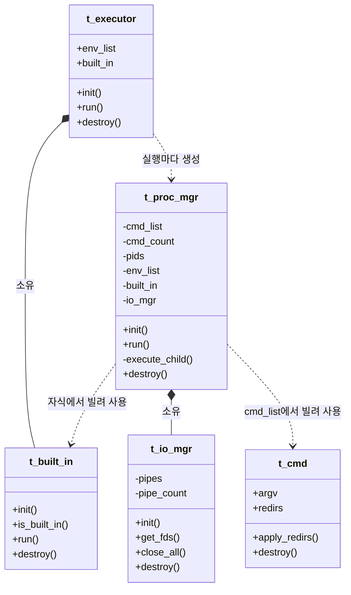

# Minishell 실행기 설계

## 현재 구현 범위

단독 내장 명령은 부모에서 실행하고, 외부 명령과 파이프라인은 자식 프로세스에서
실행한다. 파이프 FD를 연결한 뒤 각 명령의 리다이렉션을 입력 순서대로 적용한다.
따옴표·변수 확장, 필수 내장 명령 7종, 리다이렉션, heredoc, 시그널 처리는 각각
[파싱·확장](Parsing-Expansion-Design.md), [내장 명령과 환경](Builtins-Environment-Design.md),
[리다이렉션과 heredoc](Redirection-Heredoc-Design.md), [시그널 처리](Signals-Design.md)에
정리했다. `io_mgr`는 명령이 N개일 때 N-1개 파이프를 미리 만들므로 사용 가능한 FD
개수에 제한을 받는다. 검증 방법은 [필수 기능 검증](Mandatory-Validation.md)을 참고한다.

## 1. 개요 및 설계 목표

실행기(`executor`)는 파싱 결과인 명령 목록(`t_cmd_list`)을 받아 셸 내장 명령과 외부 명령, 파이프라인(`|`)을 안전하고 일관되게 실행한다. 각 구성 요소는 **단일 책임 원칙(SRP)**에 따라 역할을 나눈다.

### 주요 설계 원칙
1. **단일 책임 원칙**:
   * 프로세스 수명 관리(`proc_mgr`), 명령별 입출력 연결과 파이프 FD 관리(`io_mgr`), 내장 명령 실행(`built_in`)을 분리한다. 외부 명령은 `proc_mgr`의 자식 처리 함수가 실행한다.
2. **부모 셸과 자식 프로세스의 역할 분리**:
   * 셸 상태를 바꾸는 **단독 내장 명령(`cd`, `exit`, `export` 등)**은 부모 프로세스에서 `fork()` 없이 실행한다.
   * **파이프라인과 외부 명령**은 메인 셸이 자식 프로세스를 `fork()`해 관리한다.
3. **자원 누수와 좀비 프로세스 방지**:
   * 부모와 자식이 파이프 FD를 모두 적절히 닫아야 EOF가 전달되고 FD 누수를 막을 수 있다.
   * 생성한 모든 자식 프로세스는 `waitpid()`로 회수한다. 파이프라인의 최종 종료 상태는 **마지막 명령의 상태**를 따른다.

---

## 2. 아키텍처 및 클래스 다이어그램



### 실행 계층 구조

```text
                      [ t_executor ] (최상위 실행 창구)
                            │
             ├──────────────────────┐
             ▼                      ▼
       [ t_built_in ]          [ t_proc_mgr ]
   (실행기가 소유)       (실행마다 임시 생성)
   - 실행 시 env_list를 전달  - 환경 사본, PID, 파이프 자원 소유
                                      │
                                      ▼
                               [ t_io_mgr ]
                        (입출력 연결·파이프 자원 관리자)
                        - 파이프가 없어도 항상 존재
                        - 파이프 FD 배열은 필요할 때만 소유
```

---

## 3. 컴포넌트별 상세 역할 및 책임

| 컴포넌트 | 책임 (단일 책임) | 실행 위치 |
| :--- | :--- | :--- |
| **`t_executor`** | 최상위 실행 창구. 명령을 판별해 **단독 내장 명령** 또는 **프로세스 관리자(`t_proc_mgr`)**에 실행을 맡김 | 메인 셸(부모) |
| **`t_built_in`** | `cd`, `echo`, `pwd`, `export`, `unset`, `env`, `exit`의 내장 로직 실행. `run()` 호출 시 받은 `env_list`만 읽거나 갱신하며, 환경을 소유하거나 보관하지 않음 | 부모 셸 또는 자식 프로세스 |
| **`t_proc_mgr`** | 환경 사본(`t_env_list`)·PID 배열·`t_io_mgr`를 소유한다. `cmd_list`와 `built_in`은 빌려 쓰며, 자식 `fork()`, 파이프 입출력 연결, 외부 명령 실행, `waitpid()`와 종료 상태 회수를 담당 | 메인 셸(부모) |
| **`t_io_mgr`** | 명령 수에 따라 명령별 입출력 FD를 배정한다. 명령이 여러 개($N > 1$)면 $N-1$개 파이프를 만들고 회수하며, 명령이 하나면 파이프 없이 `(-1, -1)`을 배정한다 | `t_proc_mgr` 내부 |

---

### 환경 정보와 소유권

- `app`은 원본 `t_env_list`를 소유하고 실행기는 이를 빌려 쓴다.
- 실행기는 값 멤버인 `t_built_in`을 소유하지만, `t_built_in`은 `env_list`를 저장하지 않는다.
- 단독 내장 명령은 실행기의 `env_list`를 `run()`에 전달해 부모 셸의 환경을 변경한다.
- 외부 명령이나 파이프라인에서는 `proc_mgr`가 시작 시점의 환경을 값 멤버 `t_env_list`로 복사하고, `io_mgr`도 값 멤버로 소유한다. 각 자식의 내장 명령은 이 환경 사본을 받아 사용하므로 변경 사항은 해당 자식에만 남는다.

따라서 파이프라인 도중 `t_built_in`의 멤버 환경을 교체할 필요가 없다. 각 `run()` 호출부에서 어떤 환경을 읽고 바꾸는지 확인할 수 있다.

---

## 4. $N+1$ 입출력 채널 경계

$N$개의 명령어가 파이프로 연결되어 있을 때, 입출력 경계는 개념적으로 항상 **$N+1$개**가 존재한다:

```text
[입력 채널 0] ───> [명령 0] ───> [입출력 채널 1] ───> [명령 1] ───> ... ───> [출력 채널 N]
(표준 입력 / heredoc)             (파이프 0)                                 (표준 출력)
```

* **채널 연결 규칙**: $i$번째 명령어($0 \le i < N$)는 항상 **`i`번 채널에서 읽고 `i + 1`번 채널에 쓴다.**
  * $i = 0$: `in_fd = STDIN_FILENO`, `out_fd = pipe[0][1]`
  * $0 < i < N - 1$: `in_fd = pipe[i-1][0]`, `out_fd = pipe[i][1]`
  * $i = N - 1$: `in_fd = pipe[N-2][0]`, `out_fd = STDOUT_FILENO`
  * $N = 1$ (단일 명령): `in_fd = STDIN_FILENO`, `out_fd = STDOUT_FILENO` (파이프 0개)
* **파이프라인과 리다이렉션의 결합**:
  * 파이프 FD를 연결한 뒤 리다이렉션을 입력 순서대로 적용한다. 명령의 리다이렉션은 기본 파이프 채널을 대체하지만, 앞서 적용한 리다이렉션의 파일 부수 효과는 유지된다.

---

## 5. 실행 시나리오 흐름

### 시나리오 1: 단독 내장 명령 또는 리다이렉션만 있는 명령 ($N = 1$)
1. `t_executor`가 단독 명령인지 확인한다. `argv`가 비어 있어도 리다이렉션이 있으면 부모 실행 경로를 사용한다.
2. 부모 실행 경로에서 표준 입력과 출력을 저장한 뒤 리다이렉션을 입력 순서대로 적용한다.
3. `argv`가 있으면 내장 명령을 실행해 환경과 작업 디렉터리 변경을 유지한다. `> file`처럼 `argv`가 없으면 파일 작업만 수행한다.
4. 명령이나 리다이렉션이 실패해도 저장한 표준 입력과 출력을 복원하고 종료 상태를 반환한다.

### 시나리오 2: 외부 명령 하나 (`ls -la`, $N = 1$)
1. `t_executor`가 실행을 `t_proc_mgr`에 맡긴다.
2. `t_proc_mgr`가 소유한 `t_io_mgr`는 파이프 없이 초기화되며, `get_fds(0)`은 `in_fd = -1`, `out_fd = -1`을 반환한다.
3. 표준 입출력을 그대로 둔 채 `fork()`를 한 번 호출한다.
4. 자식 프로세스는 `exec_external_child()`에서 `execve()`를 실행한다.
5. 부모 프로세스는 자식을 `waitpid()`로 회수하고 종료 상태를 반환한다.

### 시나리오 3: 다단 파이프라인 (`cat /etc/passwd | grep a | wc -l`, $N = 3$)
1. `t_executor`가 실행을 `t_proc_mgr`에 맡긴다.
2. `t_proc_mgr`가 소유한 `t_io_mgr`가 파이프 두 개를 연다.
3. 세 명령에 대해 `io_mgr.get_fds(i, &in_fd, &out_fd)`를 차례로 호출한 뒤 `fork()`한다.
   * 자식 0: `in_fd = STDIN`, `out_fd = pipe[0][1]`
   * 자식 1: `in_fd = pipe[0][0]`, `out_fd = pipe[1][1]`
   * 자식 2: `in_fd = pipe[1][0]`, `out_fd = STDOUT`
   * 각 자식은 `dup2()`로 입출력을 연결하고 `io_mgr.close_all()`을 호출한 뒤 명령을 실행한다.
4. 모든 자식을 만든 뒤 부모는 `io_mgr.close_all()`을 호출해 파이프 FD를 닫고 EOF를 전달한다.
5. 부모는 모든 자식을 `waitpid()`로 회수하고 마지막 명령(`wc -l`)의 종료 상태를 최종 상태로 반환한다.
6. `io_mgr.destroy()`와 `proc_mgr.destroy()`로 실행 중 생성한 메모리를 해제한다.

### 시나리오 4: 파이프라인 속 내장 명령 (`echo alpha | cat | wc -c`)
1. 파이프라인의 모든 명령을 자식 프로세스로 만들고 표준 입력과 출력을 `dup2()`로 연결한다.
2. 첫 자식에서 `echo`가 내장 명령임을 확인하고 확장된 `argv`로 실행한다.
3. `echo`의 표준 출력은 파이프에 연결되어 있으므로 텍스트가 `cat`을 거쳐 `wc`에 전달된다.
4. 각 자식은 자신의 종료 상태로 끝나며, 부모는 마지막 명령의 상태를 파이프라인 결과로 반환한다.

---

## 6. 소스 코드 파일 구성

| 파일 경로 | 소속 컴포넌트 | 주요 역할 |
| :--- | :--- | :--- |
| `include/executor.h` | 공개 헤더 | `t_executor` 및 외부 실행 API 선언 |
| `include/built_in.h` | 공개 헤더 | `t_built_in` 및 빌트인 실행 API 선언 |
| `include/proc_mgr.h` | 공개 헤더 | `t_proc_mgr` 및 프로세스 실행 API 선언 |
| `include/io_mgr.h` | 공개 헤더 | `t_io_mgr` 및 명령별 입출력 연결 API 선언 |
| `src/executor/executor.c` | `t_executor` | 최상위 실행 진입점 및 실행 분기 |
| `src/built_in/built_in.c` | `t_built_in` | 빌트인 판별·실행 인터페이스와 생명주기 |
| `src/proc_mgr/proc_mgr.c` | `t_proc_mgr` | 프로세스 매니저 생성과 해제 및 `fork()` 흐름 |
| `src/proc_mgr/proc_mgr_impl.c` | `t_proc_mgr` 내부 구현 | `fork()` 처리, 자식 FD 연결 및 시그널 초기화 |
| `src/proc_mgr/proc_mgr_wait.c` | `t_proc_mgr` 내부 구현 | `waitpid()` 회수, 종료 상태 변환 및 실패 복구 |
| `src/proc_mgr/proc_mgr_exec_external.c` | `t_proc_mgr` 내부 구현 | 외부 명령 경로 탐색 및 `execve()` 호출 |
| `src/io_mgr/io_mgr.c` | `t_io_mgr` | 명령별 FD 배정, 파이프 생성 및 전체 FD 회수 |


## 7. 실패 처리와 검증

- 모든 명령을 `fork()`한 뒤 자식을 기다리므로 파이프 버퍼보다 큰 출력도 전달할 수 있다.
- 자식은 SIGINT, SIGQUIT, SIGPIPE의 기본 동작을 복원한다. `dup2()` 뒤 원본 파이프
  FD를 `close_all()`에서 각각 닫고, 부모도 자식을 기다리기 전에 모든 파이프 FD를 닫는다.
- `waitpid()`가 EINTR로 중단되면 같은 PID를 다시 기다린다. 모든 자식을 회수한 뒤 마지막
  명령의 종료 상태를 반환한다. 시그널 종료 상태는 128에 시그널 번호를 더한다.
- `fork()` 도중 실패하면 열린 파이프를 닫고 이미 만든 자식에 SIGKILL을 보내 회수한다.
  자식이 입력이나 긴 작업을 기다리는 경우에도 정리가 멈추지 않게 한다.
- `pipe()`/`fork()`/`dup2()`/`waitpid()` 오류는 공통 오류 처리 창구에 보고한다. 부모 측 실패는
  FAIL을 반환하고 호출자의 종료 상태 출력 매개변수를 보존한다.

`make -C Tests proc_mgr`는 GNU 링커의 `--wrap` 옵션으로 시스템 호출 실패와 EINTR을
주입한다. 일부 자식 생성 중 발생하는 `fork()`/`pipe()` 실패, `dup2()` 실패, 시그널 종료, 반복 실행 시 FD 개수와
자식 회수를 검증한다. 이 옵션은 테스트 바이너리에만 적용된다.
`make -C Tests integration`은 실제 셸의 출력과 종료 상태를 Bash와 비교하고,
대용량 출력과 조기 종료도 검사한다. 각 셸 실행에 GNU `timeout` 제한 시간을 적용한다.
